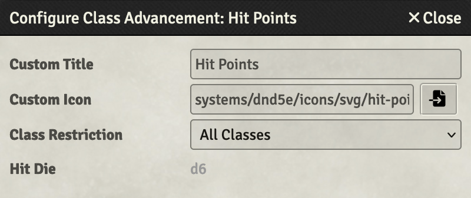
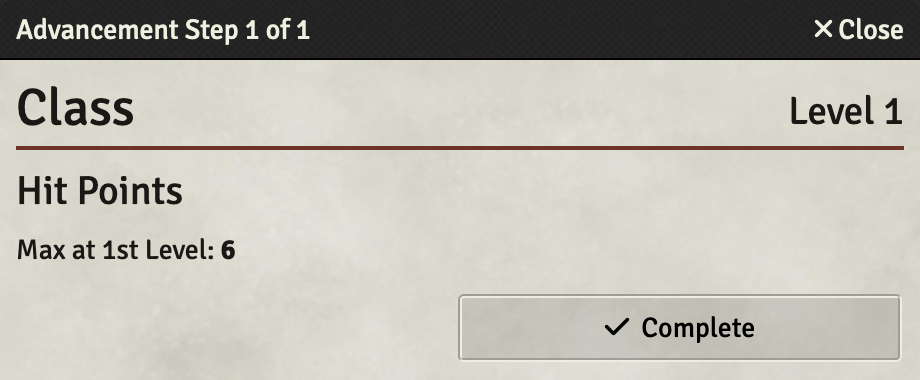
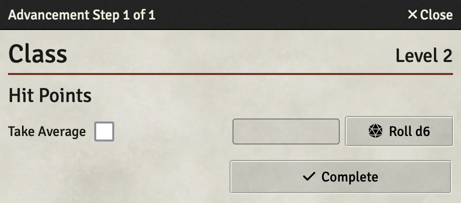

The Hit Points advancement type keeps track of hit point choices for each level of a class. This advancement can only be added to classes and each class can only have a single advancement of this type.

## Configuration



The Hit Points advancement requires no configuration. It will take a custom title and icon like all other advancement types, but everything else is handled automatically including fetching the hit dice type from the class to which it was added.

## Usage



Using the Hit Points advancement is almost as simple as setting it up. At the character's first level there are no options to choose because all level one characters get the maximum hit points allowed by their hit dice. The character's constitution modifier will automatically be added with the hit points, so be sure it is set before adding the first class.



At higher levels you are given an option between taking the average hit points (half the max + 1) or rolling for hit points. If the "Take Average" option is selected, it will be remembered at future levels but can be changed at any point.

## API

The original proposal for the Hit Points advancement can be [found here](https://github.com/foundryvtt/dnd5e/issues/1402).

### Configuration Schema

None

### Value Schema

The Hit Points advancement stores decisions as an object with an entry for each class level. For the initial character level it will store `max` indicating the maximum hit points were awarded automatically. For other levels it stores either `avg` indicating that the average was taken or a number indicating what was rolled.

```javascript
{
  1: "max",
  2: 5,
  3: "avg",
  4: 2
}
```

*Note:* The advancement does not keep track of the constitution modifier added at any given level.

### Methods

- `HitPointsAdvancement#total`: Total hit points provided by this advancement across all awarded levels.
