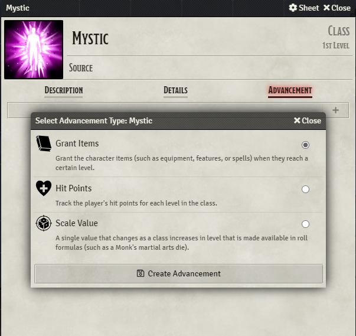
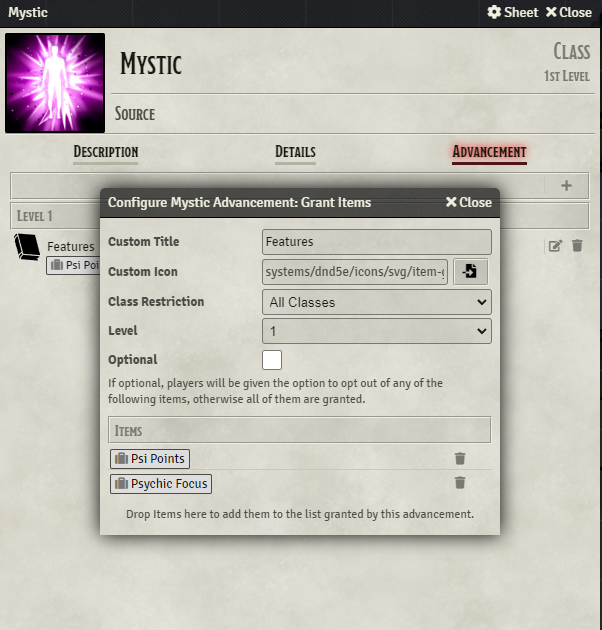
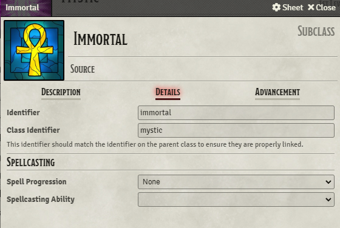

Content that may have been modifying the old `CONFIG.DND5E.classFeatures` object in order to add feature progression for custom classes should instead configure advancements directly on those class items using the new system. Since this data is stored on the class item itself, it can be placed directly inside a compendium and requires no additional script support to plug-into the system.

### Features
To add features to a class, go to the class' 'Advancement' tab, click the '+' sign to add a new advancement, and select the 'Item Grant' advancement.

Select the level at which these features are gained, then drag-and-drop the feature items to the bottom section of the sheet.

**Note:** These items are referenced by UUID so do not use world-level items if you intend this class to be portable between worlds. If you wish to store the class in a compendium to be transferred between worlds, you should also store the features in a compendium (it can be the same one as the class item) and make sure to drag-and-drop from that compendium onto the Item Grant Advancement configuration.

Repeat this process for each level that features are gained in this class.

### Subclasses
Classes and subclasses are linked together by their identifiers. In order to create a subclass for a given class, first locate the class identifier.

Then create the new subclass item and input the parent class' identifier.

